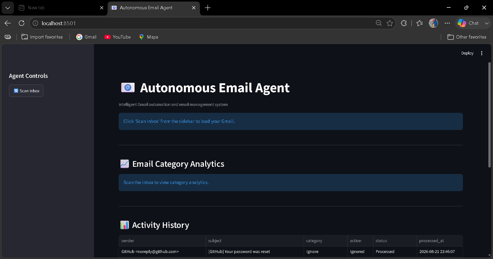
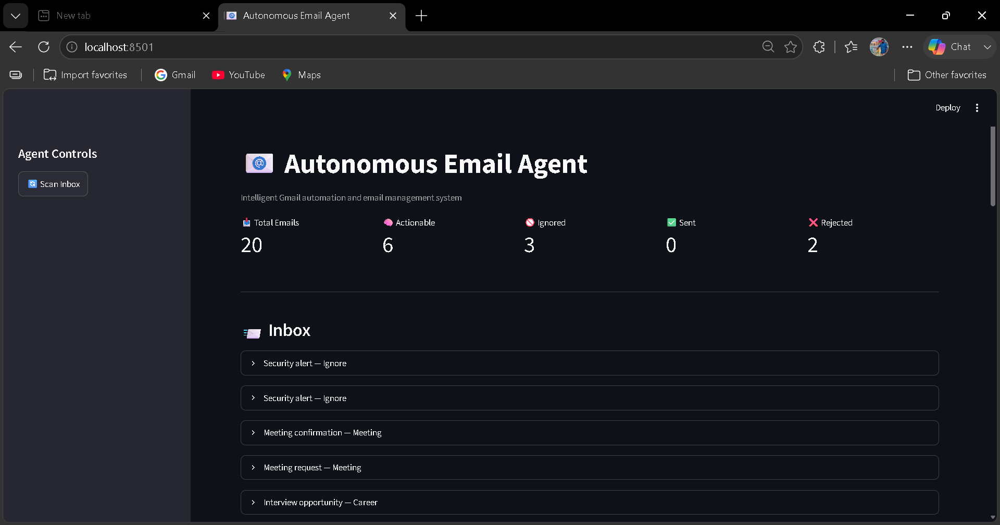
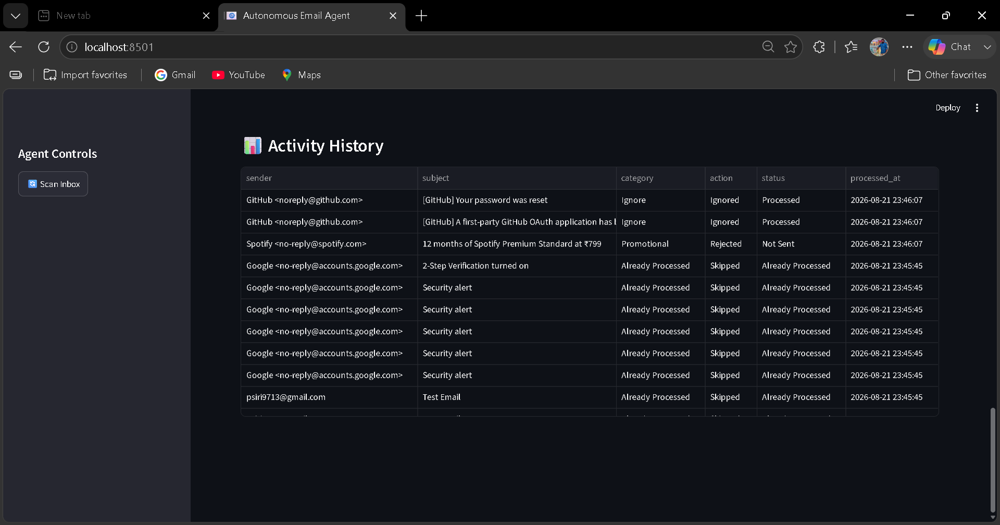

# 📧 Autonomous Email Agent

An intelligent Gmail automation system that reads unread emails, classifies them, generates suitable replies, and allows the user to approve or reject replies before sending.

## 🚀 Features

- Connects with Gmail using Gmail API and OAuth 2.0
- Reads unread emails from Gmail
- Extracts sender, subject, and email body
- Classifies emails into categories
- Ignores security and system emails
- Prevents duplicate email processing
- Generates automatic email replies
- Provides Send / Reject approval controls
- Sends approved replies through Gmail
- Stores email activity in SQLite database
- Provides a Streamlit dashboard
- Displays email category analytics
- Maintains activity history
- Protects credentials using `.gitignore`

## 🧠 Email Categories

The system supports:

- Urgent
- Meeting
- Career
- Finance
- Promotional
- General
- Ignore

## 🏗️ System Architecture

```text
                Gmail Inbox
                     |
                     v
               Gmail Reader
                     |
                     v
            Email Classification
                     |
            +--------+--------+
            |                 |
            v                 v
          Ignore          Actionable
            |                 |
            v                 v
          Skip          Reply Generator
                              |
                              v
                       User Approval
                         /        \
                        /          \
                       v            v
                    Send          Reject
                       |
                       v
                  Gmail Sender
                       |
                       v
                 SQLite Database
                       |
                       v
              Streamlit Dashboard
autonomous-email-agent/
│
├── app.py
├── main.py
├── gmail_reader.py
├── email_reader.py
├── email_classifier.py
├── email_generator.py
├── email_sender.py
├── email_memory.py
├── email_processor.py
├── database.py
├── test_api.py
├── requirements.txt
├── .gitignore
├── README.md
│
├── data/
│   └── sample_emails.json
│
└── utils/
    └── prompts.py
## Project Output

### Dashboard


### Email Classification


### Reply / Action


### Activity History

